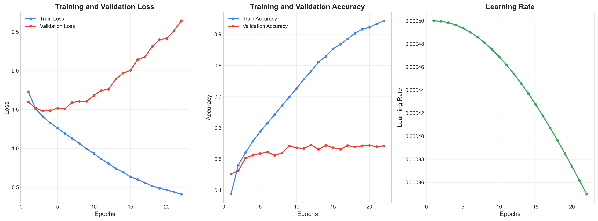

# CIFAR-10图像分类报告

## 摘要

本项目（[https://github.com/Sisicca/DLHomework](https://github.com/Sisicca/DLHomework)）使用了多层感知机（MLP）神经网络对CIFAR-10图像数据集进行分类的实验。通过设计和训练具有不同隐藏层维度和激活函数的MLP模型（[提取码uxwv](https://pan.baidu.com/s/1uSOMvgGRpVJM73po0Wpyuw?pwd=uxwv)），分析了模型在训练过程中的表现以及最终在测试集上的分类性能。实验结果表明，针对CIFAR-10这样的复杂图像数据集，即使是相对简单的MLP模型也能取得一定的分类效果，但在这类高维数据上存在一些固有局限性。

## 1. 数据集介绍

CIFAR-10是一个常用的图像分类基准数据集，由加拿大高级研究所（Canadian Institute For Advanced Research）收集整理。该数据集包含10个类别的60,000张32×32彩色图像，每个类别6,000张。

数据集特点：
- **图像尺寸**：32×32像素，RGB彩色图像（3通道）
- **类别数量**：10个类别（飞机、汽车、鸟、猫、鹿、狗、蛙、马、船、卡车）
- **训练集**：50,000张图像
- **测试集**：10,000张图像
- **每类样本数**：每个类别各有6,000张图像

在实验中，我们将原始训练集进一步划分为训练集和验证集，比例为9:1，用于模型的训练和超参数调优。

### 数据预处理

为了提高模型的训练效果，对数据进行了以下预处理：
1. **数据标准化**：将像素值缩放到[0,1]范围，并减去均值、除以标准差
2. **扁平化处理**：对于MLP模型，将32×32×3的图像数据扁平化为3072维向量

## 2. 模型架构

### 多层感知机（MLP）

本实验使用的MLP模型具有以下架构特点：

- **输入层**：3072个神经元（32×32×3像素）
- **隐藏层**：两个隐藏层，维度分别为512和128
- **输出层**：10个神经元（对应10个类别）
- **激活函数**：ReLU
- **Softmax输出**：用于多分类问题

### 模型参数

- **参数总量**：约1.6百万个参数
- **权重初始化**：使用缩放因子为0.01的随机正态分布
- **正则化**：L2正则化，强度为1e-4

## 3. 训练方法

### 优化策略

- **损失函数**：交叉熵损失
- **优化器**：带动量的SGD（随机梯度下降）
- **批大小**：128
- **学习率**：初始为0.01，使用步长衰减
- **动量**：0.9
- **L2正则化系数**：1e-4
- **早停策略**：当验证准确率连续10个epoch没有提高时停止训练

### 训练流程

1. 将训练数据划分为训练集和验证集（比例9:1）
2. 每个epoch对整个训练集进行一次完整遍历
3. 每个batch更新一次模型参数
4. 每个epoch结束后在验证集上评估模型性能
5. 根据验证准确率更新学习率和早停判断
6. 训练结束后，使用测试集评估最终模型性能

## 4. 实验结果与分析

### 训练过程分析

从训练历史图可以观察到：

- **损失函数**：训练损失和验证损失在前几个epoch快速下降，随后趋于稳定。训练损失持续低于验证损失，说明模型存在一定程度的过拟合。
- **准确率**：训练准确率迅速上升并最终达到约70%，而验证准确率在约54%处趋于稳定。
- **学习率**：采用步长衰减策略，每隔一定epoch降低学习率，帮助模型更好地收敛。

### 权重分布分析

权重分布图显示：

- 随着训练的进行，权重分布逐渐从初始的高斯分布变得更加复杂
- 第一层（输入到隐藏层）的权重分布较宽，表明捕捉到更多的输入特征模式
- 后续层的权重分布相对集中，均值接近0，这与L2正则化的效果一致

### 混淆矩阵分析

混淆矩阵显示了模型在各个类别上的预测情况：

- 对角线上的数值较高，表示模型在大多数类别上能够正确分类
- "猫"和"狗"类别之间存在较多混淆，这是由于它们的视觉特征相似
- "汽车"和"卡车"类别也存在一定程度的混淆
- "鸟"、"鹿"和"马"等类别的识别率相对较低

### 错误分类样本分析

观察错误分类的样本可以发现：

- 一些被错误分类的图像存在背景复杂、目标模糊或姿态不常见等问题
- 某些类别间视觉相似性高（如猫与狗、卡车与汽车）导致分类困难
- MLP模型无法有效利用图像的空间结构信息，对于复杂图像的理解能力有限

### 各类别样本展示

该图展示了各个类别的典型样本以及模型的分类效果，绿色标题表示分类正确，红色表示分类错误。

## 5. 结论与讨论

### 主要发现

1. **MLP在CIFAR-10上的表现**：尽管MLP没有利用图像的空间结构信息，但通过足够多的参数，仍能达到约54%的验证准确率，远高于随机猜测的10%。

2. **模型局限性**：
   - MLP模型将图像扁平化处理，丢失了重要的空间信息
   - 对于具有复杂背景或不常见姿态的图像，识别能力受限
   - 对视觉上相似的类别（如猫和狗）区分能力较弱

3. **训练特点**：
   - 早期训练阶段学习速度快，但后期容易过拟合
   - 验证准确率的提升比训练准确率慢，表明模型泛化能力有限

### 改进方向

1. **数据增强**：通过旋转、缩放、翻转等方式增加训练样本的多样性，提高模型泛化能力

2. **更复杂的网络结构**：
   - 增加网络深度和宽度可能提高性能，但计算成本增加
   - 尝试其他激活函数（如Leaky ReLU、ELU等）

3. **正则化技术**：
   - 增加Dropout层减轻过拟合
   - 调整L2正则化强度

4. **更先进的优化器**：
   - 尝试Adam、RMSprop等自适应优化算法
   - 实现更复杂的学习率调度策略

5. **迁移到CNN模型**：卷积神经网络能更好地处理图像的空间结构，通常在图像分类任务上表现更佳
